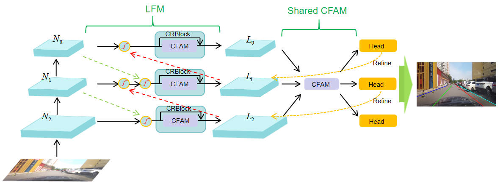
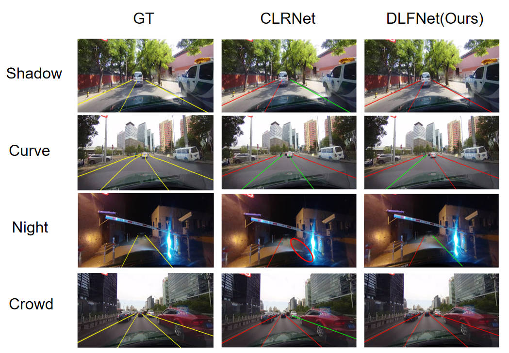

<div align="center">

# DLFNet: Multi-Scale Dynamic Weighted Lane Feature Network for Complex Scenes

</div>


Pytorch implementation of the paper "[Dynamic Lane Feature Network: Multi-Scale Dynamic Weighted Lane Feature Network for Complex Scenes]

## Introduction

- DLFNet is based on the BiFPN concept and the way humans perceive and reason about lane lines in the real world, achieving the integration of global semantic information with local feature details.
-   In culane and tusimple, the performance is superior , especially at high IOU threshold

## Installation

### Prerequisites
Only test on Ubuntu18.04 and 20.04 with:
- Python >= 3.8 (tested with Python3.8)
- PyTorch >= 1.6 (tested with Pytorch1.6)
- CUDA (tested with cuda10.2)
- Other dependencies described in `requirements.txt`

### Clone this repository
Clone this code to your workspace. 
We call this directory as `$DLFNET_ROOT`
```Shell
git clone https://github.com/EADMO/DLFNet.git
```

### Create a conda virtual environment and activate it (conda is optional)

```Shell
conda create -n dlfnet python=3.8 -y
conda activate dlfnet
```

### Install dependencies

```Shell
# Install pytorch firstly, the cudatoolkit version should be same in your system.

conda install pytorch torchvision cudatoolkit=10.1 -c pytorch

# Or you can install via pip
pip install torch==1.8.0 torchvision==0.9.0

# Install python packages
python setup.py build develop
```

### Data preparation

#### CULane

Download [CULane](https://xingangpan.github.io/projects/CULane.html). Then extract them to `$CULANEROOT`. Create link to `data` directory.

```Shell
cd $DLFNET_ROOT
mkdir -p data
ln -s $CULANEROOT data/CULane
```

For CULane, you should have structure like this:
```
$CULANEROOT/driver_xx_xxframe    # data folders x6
$CULANEROOT/laneseg_label_w16    # lane segmentation labels
$CULANEROOT/list                 # data lists
```


#### Tusimple
Download [Tusimple](https://github.com/TuSimple/tusimple-benchmark/issues/3). Then extract them to `$TUSIMPLEROOT`. Create link to `data` directory.

```Shell
cd $DLFNET_ROOT
mkdir -p data
ln -s $TUSIMPLEROOT data/tusimple
```

For Tusimple, you should have structure like this:
```
$TUSIMPLEROOT/clips # data folders
$TUSIMPLEROOT/lable_data_xxxx.json # label json file x4
$TUSIMPLEROOT/test_tasks_0627.json # test tasks json file
$TUSIMPLEROOT/test_label.json # test label json file

```

For Tusimple, the segmentation annotation is not provided, hence we need to generate segmentation from the json annotation. 

```Shell
python tools/generate_seg_tusimple.py --root $TUSIMPLEROOT
# this will generate seg_label directory
```


## Getting Started

### Training
For training, run
```Shell
python main.py [configs/path_to_your_config] --gpus [gpu_num]
```

For example, run
```Shell
python main.py configs/resnet18_culane.py --gpus 0
```

### Validation
For testing, run
```Shell
python main.py [configs/path_to_your_config] --[test|validate] --load_from [path_to_your_model] --gpus [gpu_num]
```

For example, run
```Shell
python main.py configs/dla34_culane.py --validate --load_from culane_dla34.pth --gpus 0
```

At present, this code can output the visual results and GT . You only need to add add `--view` or `--view_gt`
We will get the visualization result in `work_dirs/xxx/xxx/visualization`.


## Results


[assets]: https://github.com/EADMO/DLFNet/releases

### CULane

|   Backbone  |  mF1 | F1@50  | F1@75 |
| :---  |  :---:   |   :---:    | :---:|
| [ResNet-18][assets]     | 55.35  |  79.77   | 62.64 |
| [ResNet-34][assets]     | 55.14  |  79.77   | 62.83 |
| [ResNet-101][assets]     | 55.86 | 80.18   | 63.43 |
| [DLA-34][assets]     | 56.25 |  80.45   | 63.56 |


### TuSimple
|   Backbone   |      F1   | Acc |      FDR     |      FNR   |
|    :---       |          ---:          |       ---:       |       ---:       |      ---:       |
| [ResNet-18][assets]     |    97.91    |   96.88  |    2.54  |  1.62      | 
| [ResNet-34][assets]       |   97.82              |    96.92          |   2.56          |    1.79      | 
| [ResNet-101][assets]      |   97.89|   96.77  |   1.81   |  2.41  |


## Acknowledgement
<!--ts-->
* [Turoad/clrnet](https://github.com/Turoad/clrnet)
* [open-mmlab/mmdetection](https://github.com/open-mmlab/mmdetection)
* [pytorch/vision](https://github.com/pytorch/vision)
* [Turoad/lanedet](https://github.com/Turoad/lanedet)
* [ZJULearning/resa](https://github.com/ZJULearning/resa)
* [cfzd/Ultra-Fast-Lane-Detection](https://github.com/cfzd/Ultra-Fast-Lane-Detection)
* [lucastabelini/LaneATT](https://github.com/lucastabelini/LaneATT)
* [aliyun/conditional-lane-detection](https://github.com/aliyun/conditional-lane-detection)
<!--te-->
